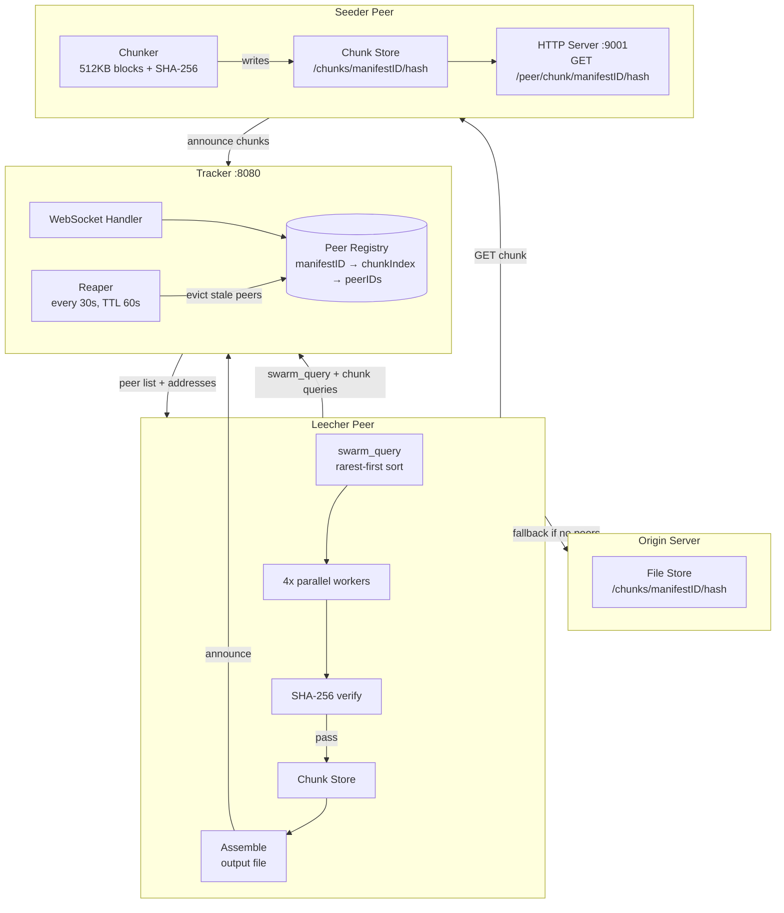
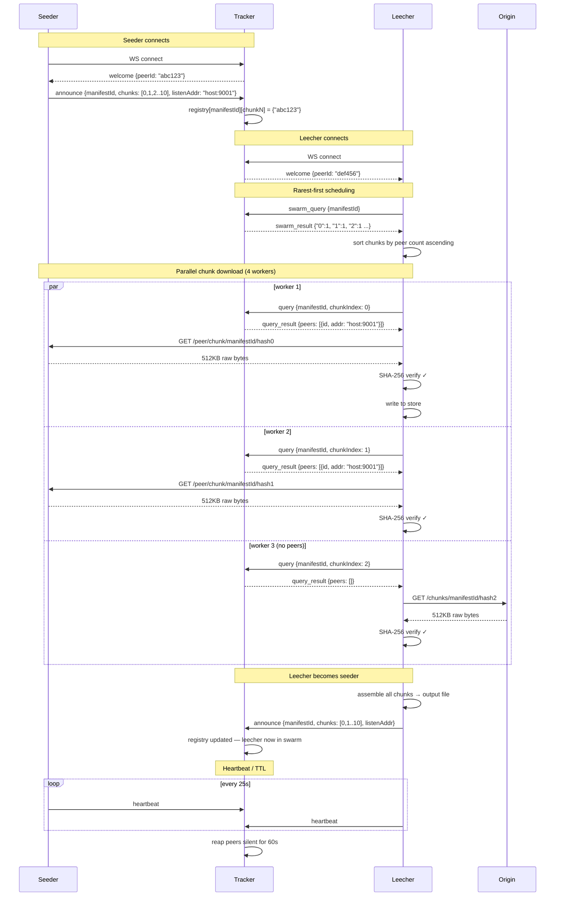
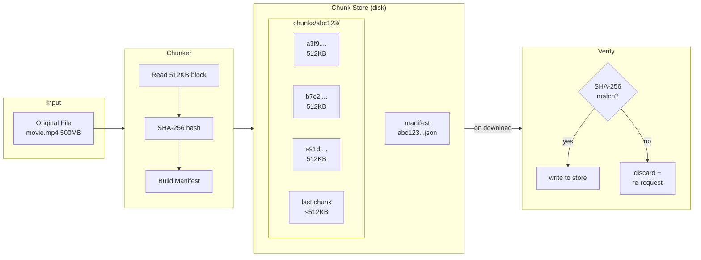
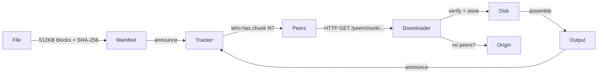

# PeerCDN

P2P content delivery network written in Go. Files are split into chunks and served directly between peers, the central server only handles peer discovery and never sees file data. Built this as a side project in my 3rd year of BTech after getting frustrated reading about how CDNs work without any good hands-on examples.

The architecture is closer to a stripped-down BitTorrent than a traditional CDN. A tracker maintains a registry of which peers hold which chunks. Downloaders query the tracker, get a list of peers, and fetch directly over HTTP. Chunks are SHA-256 verified before being written to disk. The tracker itself is just a WebSocket server, lightweight enough to run on a $5 VPS.

### This project supports all mime types and works like BitTorrent and Cloudflare combined, I built this as a side project during my college 3rd year, would try my best to improve upon this in coming time.

---

## Architecture


### Overall system flow



### Signaling protocol in detail




### Chunk store internals



Chunk transfer between Go peers is plain HTTP — the seeder runs a lightweight HTTP server on `--listen`, exposes chunks at `/peer/chunk/<manifestID>/<hash>`. No WebSocket, no WebRTC for Go↔Go. Browser peers use the same HTTP endpoints, with WebRTC as a future path for browser↔browser.

---

## How files move

**Chunking** — the chunker reads the file in 512KB blocks, SHA-256 hashes each block, and writes a manifest JSON + one file per chunk on disk. The manifest ID is the SHA-256 of the full file, so you can verify the whole thing at the end.

**Announcing** — when a seeder starts, it sends an `announce` message to the tracker with the manifest ID and a list of chunk indexes it holds. The tracker stores this in an in-memory registry.

**Downloading** — the leecher first sends a `swarm_query` to get a chunk→peerCount map, sorts missing chunks by ascending count (rarest-first), then fires up to 4 parallel workers. Each worker queries the tracker for peers holding that chunk and fetches via HTTP. Chunks that fail integrity checks are discarded and retried. If no peer has a chunk, falls back to origin.

**Heartbeat** — peers send a heartbeat every 25s. The tracker reaps any peer that goes silent for 60s. This keeps the registry clean when peers crash or disconnect without a clean close.

---

## Running it

```bash
go mod tidy && make all
```

```bash
./bin/tracker --addr :8080

./bin/chunker --file ./movie.mp4 --out ./chunks --mime video/mp4

./bin/peer seed \
  --tracker ws://localhost:8080/ws \
  --manifest ./chunks/<id>.json \
  --store ./chunks \
  --listen :9001

./bin/peer get \
  --tracker ws://localhost:8080/ws \
  --manifest ./chunks/<id>.json \
  --store ./dl-chunks \
  --origin http://your-origin:9000 \
  --out ./movie-copy.mp4
```

---

## Signaling protocol

WebSocket + JSON frames. The tracker is purely a coordination layer.

| type | direction | description |
|---|---|---|
| `announce` | C→S | declare chunk ownership for a manifest |
| `query` | C→S | get peers holding chunk N of manifest M |
| `swarm_query` | C→S | get peer counts per chunk (for rarest-first) |
| `heartbeat` | C→S | keep-alive |
| `offer/answer/ice` | C↔S | WebRTC relay (browser peers) |
| `welcome` | S→C | assigned peerID on connect |
| `query_result` | S→C | peer list with addresses |
| `swarm_result` | S→C | `{"0": 3, "1": 1, "2": 4, ...}` |

---

## Manifest format

```json
{
  "version": 1,
  "id": "<sha256 of whole file>",
  "name": "movie.mp4",
  "size": 524288000,
  "chunkSize": 524288,
  "mimeType": "video/mp4",
  "createdAt": 1710000000,
  "chunks": [
    { "index": 0, "hash": "<sha256>", "offset": 0,      "size": 524288 },
    { "index": 1, "hash": "<sha256>", "offset": 524288, "size": 524288 }
  ]
}
```

Distribute the manifest out-of-band (HTTP, paste, whatever). The manifest ID doubles as a content address — if the file changes the ID changes.

---

## What works

- file chunking + SHA-256 integrity at chunk and whole-file level
- tracker with in-memory peer registry and TTL eviction
- rarest-first scheduling via swarm size queries
- parallel chunk downloads with semaphore (default 4)
- direct HTTP peer-to-peer transfer
- origin HTTP fallback
- browser client (same HTTP chunk fetching, rarest-first, announces after download)
- seed-after-download — leecher automatically becomes seeder on completion

## Workflow


## Known gaps

- no origin server binary yet — you need to bring your own HTTP server for the fallback
- Go↔Go peer address resolution works but browser peers can't serve chunks back (browsers can't run HTTP servers), so browser→browser transfer needs WebRTC which isn't wired up yet
- no resume — if a download is interrupted you start over
- tracker has no auth, rate limiting, or persistence — it's purely in-memory
- TURN server integration missing, so peers behind strict NATs will silently fall back to origin
