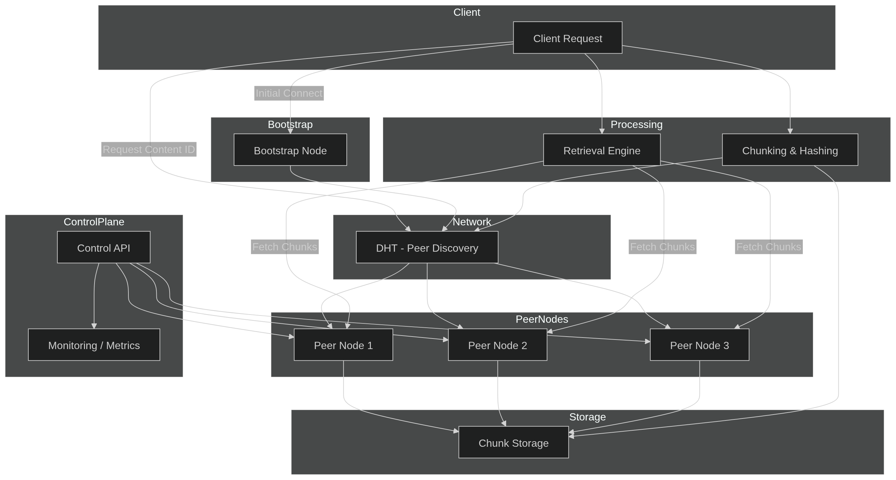

# PeerCDN

PeerCDN is a peer-to-peer content delivery network (in progress) that distributes files by allowing clients to share cached chunks with each other instead of relying entirely on centralized servers.

Instead of every user downloading content from a single origin server, PeerCDN lets users fetch chunks from nearby peers that already downloaded them. Each client becomes a temporary edge node, helping distribute content across the network.

The system is inspired by peer-to-peer protocols such as BitTorrent and traditional CDN architectures.

---

# How It Works

Files are split into fixed-size chunks that can be downloaded independently.

When a client requests a file:

1. The client contacts the tracker server.
2. The tracker returns a list of peers that currently have the file chunks.
3. The client downloads chunks in parallel from multiple peers.
4. Downloaded chunks are cached locally.
5. The client becomes a peer and can serve chunks to other clients.

As more users download the file, the network automatically scales its distribution capacity.

---

# Architecture

PeerCDN consists of three main components.

## Origin Server
Stores the original files and serves chunks when peers are unavailable.

## Tracker
Maintains a mapping between file identifiers and peers that currently host chunks.

## Peers
Clients that download, cache, and distribute chunks to other peers.

Basic architecture:

Origin Server  
↓  
Tracker  
↓  
Peer Network

Peers form a distributed cache layer that reduces load on the origin server.

---

# Features

- Chunked file distribution  
- Peer discovery using a tracker  
- Parallel downloads from multiple peers  
- Local chunk caching  
- Hash verification for chunk integrity  
- Automatic peer promotion after download  

---

# Use Cases

PeerCDN can be used for:

- distributing large files
- reducing origin server bandwidth usage
- experimenting with decentralized CDN models
- learning peer-to-peer networking concepts

---

# Project Goals

The goal of this project is to explore distributed systems concepts such as:

- peer discovery
- chunked file transfer
- distributed caching
- decentralized content delivery

---